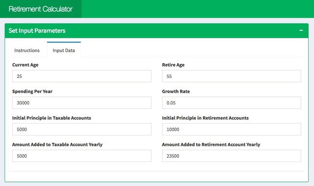
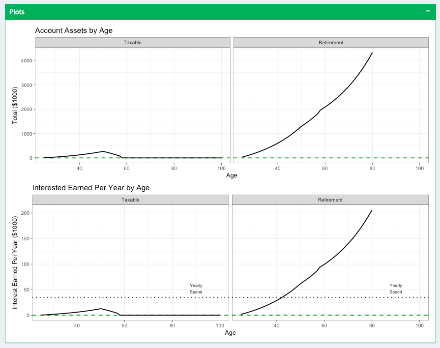
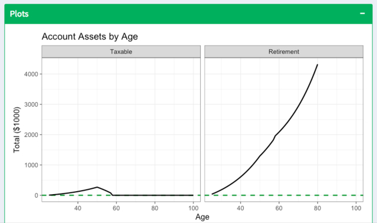
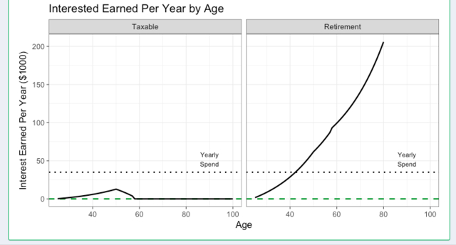

# Retirement Calculator

## Check it Out!

[Run the app](https://jennynguyen.shinyapps.io/retirement_calculator/)

## Quick Summary

This is a R Shiny application that computes rough projections for retirement savings. 

Prior to the specified retirement age, specified contributions are added to the respective accounts. Following the specified retirement age, specified withdrawals are first made from the taxable accounts and then the retirement accounts. Interest is compounded at the end of the year at the specified growth rate. The calculator can also determine whether there is a need and when to apply the Rother Ladder Conversion. A more detailed set of instructions are available in the app.

A short summary, plots of balances over time, and detailed table are displayed, that is also available for download.
