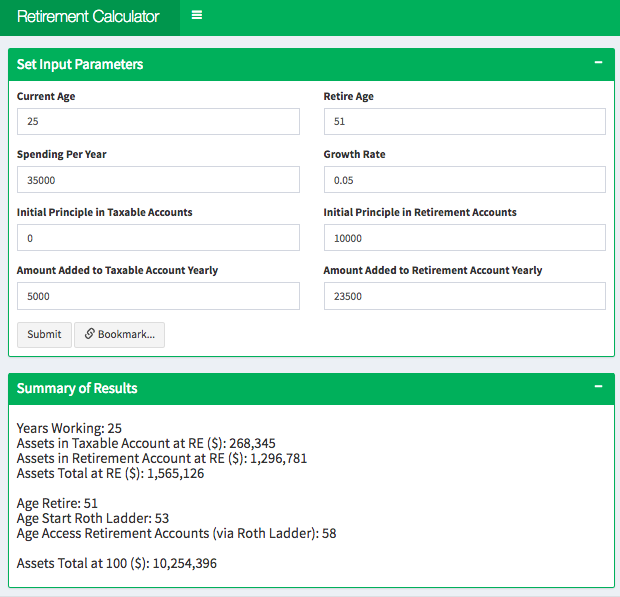
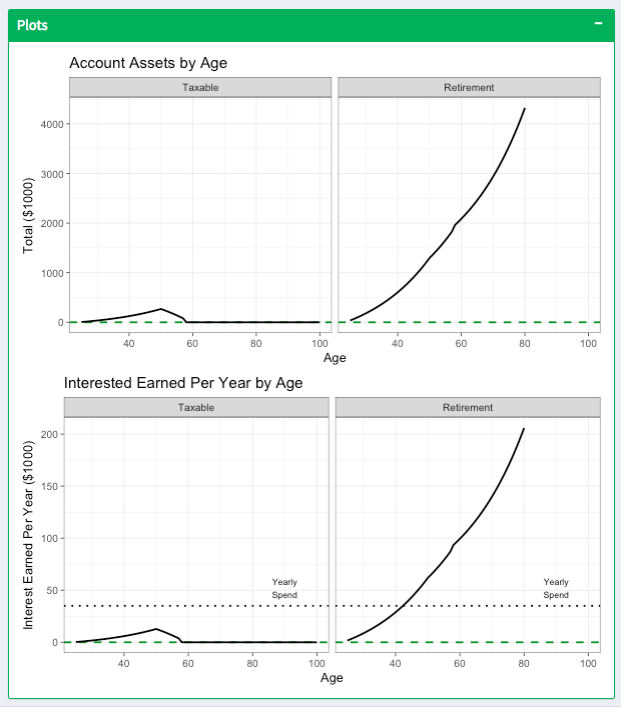

# Retirement Calculator

[Run the app](https://jennynguyen.shinyapps.io/retirement_calculator/)

This is a R Shiny application that computes rough projections for retirement savings. 

Prior to retirement, the calculator adds the **Amount Added** value to the **Initial Principle** for each the taxable and retirement account and computes the compounded interest based off of the **Growth Rate**. 

After the retirement age, the **Amount Added* is reduced to 0 and the **Spending per Year** amount is deducted from the total (from the taxable account until depletion, then from the retirement account). The calculator can also determine whether there is a need to apply the Roth Ladder Conversion. 

The calculator outputs a summary of results, 
