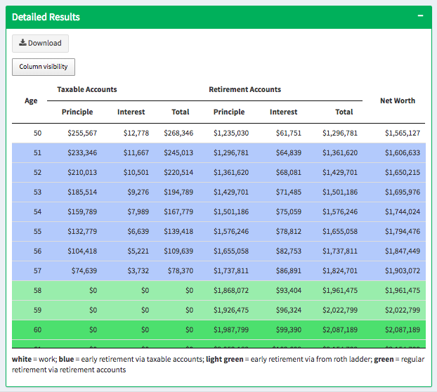

# Retirement Calculator

## Check it Out!

[Run the app here.](https://jennynguyen.shinyapps.io/retirement_calculator/)

## Quick Summary

This R Shiny application computes rough projections for retirement savings. 

Prior to the specified retirement age, specified contributions are added to the respective accounts. Following the specified retirement age, specified withdrawals are first made from the taxable accounts and then the retirement accounts. Interest is compounded at the end of the year at the specified growth rate. The calculator can also determine whether there is a need and when to apply the Rother Ladder Conversion. A detailed description of the algorithm is available in instructions tab of the app.
